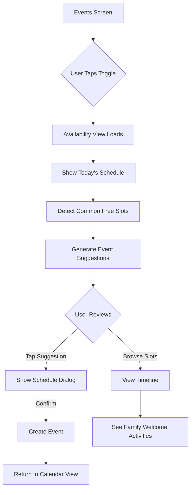

# 📅 Family Availability Calendar Feature

## Overview
The Family Availability Calendar is a smart scheduling feature in the Events module that helps families find common free time, discover when members are available, and get AI-powered suggestions for family activities.

**Location:** `lib/modules/events/`  
**Version:** 1.0  
**Status:** ✅ Implemented with Demo Data

---

## 🎯 Features

### 1. **Smart Availability Tracking**
- Track each family member's daily schedule
- Mark time slots as free/busy
- Add activity names and locations
- Tag activities as "Family Welcome" for joinable events

### 2. **Common Free Slots Detection**
- Automatically finds overlapping free time
- Shows availability percentage (e.g., 100% = everyone free)
- Highlights time windows when all/most members are available
- Displays which members are available for each slot

### 3. **AI Event Suggestions**
- Smart suggestions based on time of day and availability
- 6 event categories: Dinner 🍽️, Movie 🎬, Game Night 🎮, Outdoor 🌳, Sport ⚽, Breakfast ☕
- Time-aware matching (morning events for morning slots)
- Quality scoring based on availability percentage
- One-tap scheduling to create events

### 4. **Family Welcome Activities**
- View activities tagged as joinable
- See when family members are doing activities others can join
- Examples: gym sessions, park visits, errands that welcome company

### 5. **Timeline View**
- Visual timeline showing each member's daily schedule
- Color-coded activity blocks
- Purple border for "Family Welcome" activities
- Proportional time representation

---

## 📂 File Structure

```
lib/modules/events/
├── data/
│   └── models/
│       └── availability_model.dart         # Data models
├── view/
│   ├── events_view.dart                    # Main view with toggle
│   └── widgets/
│       └── family_availability_view.dart   # Availability UI
└── viewmodel/
    └── events_viewmodel.dart               # Business logic
```

---

## 🗂️ Data Models

### **AvailabilitySlot**
Represents a time block for a family member:

```dart
class AvailabilitySlot {
  final DateTime start;
  final DateTime end;
  final String userId;
  final String userName;
  final bool isFree;
  final String? activityName;
  final String? location;
  final bool familyWelcome;
  final Color? color;
}
```

**Properties:**
- `start/end`: Time range for the slot
- `userId/userName`: Family member identification
- `isFree`: Whether member is available (true) or busy (false)
- `activityName`: What they're doing (e.g., "Work", "School", "Gym")
- `location`: Where the activity is happening
- `familyWelcome`: Flag indicating others can join this activity
- `color`: Visual color for the activity in UI

---

### **CommonFreeSlot**
Represents time when multiple members are free:

```dart
class CommonFreeSlot {
  final DateTime start;
  final DateTime end;
  final List<String> availableMembers;
  final int totalMembers;
}
```

**Key Features:**
- `availableMembers`: List of user IDs who are free
- Computed: `availabilityPercentage` = (available / total) × 100
- Computed: `isEveryoneAvailable` checks if all members are free
- Helper: `availableMemberNames` provides user-friendly names

---

### **FamilyEventSuggestion**
AI-generated event recommendations:

```dart
class FamilyEventSuggestion {
  final String title;
  final String emoji;
  final CommonFreeSlot timeSlot;
  final String? description;
  final EventCategory category;
}
```

**Event Categories:**
1. **Dinner 🍽️** - Family meals together
2. **Movie 🎬** - Movie nights and entertainment
3. **Game Night 🎮** - Board games and family fun
4. **Outdoor 🌳** - Park visits, nature activities
5. **Sport ⚽** - Athletic activities
6. **Breakfast ☕** - Morning family time

Each category includes:
- `name`, `emoji`, `color`
- `defaultDuration` (30min - 2hrs)
- `timePreference` (morning/afternoon/evening)
- `minParticipants` required

---

## 🎨 UI Components

### **FamilyAvailabilityView**
Main widget showing the complete availability interface.

**Sections:**
1. **Date Selector** - Navigate between days with prev/next/today buttons
2. **Event Suggestions** - Highlighted cards with AI recommendations
3. **Common Free Slots** - List of overlapping free time windows
4. **Family Welcome Activities** - Joinable activities from members
5. **Timeline View** - Visual schedule for each family member

**Key Interactions:**
- Tap event suggestion → Show scheduling dialog
- Pull to refresh → Reload availability data
- Date navigation → Change selected date
- "Schedule Event" button → Create event from suggestion

---

### **Event Suggestion Card**
Premium-styled card highlighting AI suggestions:

```dart
- Large emoji icon in circular badge
- Event title and time prominently displayed
- Description of why it's a good match
- Availability count (e.g., "4 of 4 available")
- Primary color theming with elevated shadow
- Tap to schedule dialog
```

---

### **Common Free Slot Card**
Clean card showing overlapping free time:

```dart
- Green badge for 100% availability, blue for partial
- Time range (e.g., "6:00 PM - 9:00 PM")
- List of available members
- Availability percentage badge
- Member count (e.g., "4 of 4 available")
```

---

### **Family Welcome Activity Card**
Compact card for joinable activities:

```dart
- Waving hand icon (👋)
- Activity name and time
- Member name and location
- "Join!" action chip
- Color-coded by activity type
```

---

### **Timeline View**
Visual schedule representation:

```dart
- Member name header
- Horizontal time blocks
- Color-coded: Green (free), Orange/Custom (busy)
- Purple border for "Family Welcome" activities
- Proportional width based on duration
- Activity labels in blocks
```

---

## 🧠 Business Logic

### **EventsViewModel Methods**

#### **Data Loading**
```dart
Future<void> loadAvailabilityData()
```
- Loads availability for selected date
- Currently uses `_loadDemoAvailability()` with 4 members
- Triggers free slot detection and suggestion generation

#### **Demo Data**
```dart
void _loadDemoAvailability()
```
Creates realistic demo schedule:
- **Ahmed** - 9-12 Meeting, free 2-10 PM
- **Fatima** - 10-3 Work, free 6-9 PM  
- **Omar** - 8-2 School, 3-5 Soccer (family-welcome), free 4-10 PM
- **Layla** - 11-1 Gym (family-welcome), free 3-11 PM

#### **Common Free Slot Detection**
```dart
void _findCommonFreeSlots()
```
Algorithm:
1. Collects all free slots from all members
2. Finds overlapping time windows
3. Calculates availability percentage
4. Returns slots with 75%+ availability
5. Sorts by percentage (highest first)

**Current Results:**
- **6-9 PM**: All 4 members free (100%)
- **9-10 PM**: 3 members free (75%)

#### **Event Suggestion Generation**
```dart
void _generateEventSuggestions()
```
Smart matching process:
1. Takes common free slots (75%+ availability)
2. Determines time of day (morning/afternoon/evening)
3. Filters event categories by time preference
4. Creates suggestions with matching categories
5. Scores by availability percentage × quality
6. Returns top 3 suggestions

**Example Output:**
- **Dinner 🍽️** at 6-9 PM (evening slot, 100% available)
- **Movie 🎬** at 9-10 PM (evening slot, 75% available)

#### **Helper Methods**
```dart
void toggleFamilyWelcome(String userId, DateTime start, bool welcome)
List<AvailabilitySlot> getAvailabilityForMember(String userId)
List<AvailabilitySlot> get familyWelcomeActivities
void changeAvailabilityDate(DateTime newDate)
void scheduleSuggestedEvent(FamilyEventSuggestion suggestion)
```

---

## 🎯 Usage Flow

### **1. Navigate to Availability**
```
Events Screen → Toggle Icon (top-right) → Family Availability View
```

### **2. View Availability**
- See today's schedule for all members
- Browse common free slots
- Check AI event suggestions
- Find family-welcome activities

### **3. Schedule an Event**
- Tap an event suggestion card
- Review details in dialog
- See who's available
- Click "Schedule Event"
- Event is created and added to calendar

### **4. Change Date**
- Use left/right arrows to navigate days
- Click "Today" button to jump to current date
- Pull down to refresh data

---

## 🔄 Integration with Events Module

### **Toggle Between Views**
The Events screen has two modes:

**Calendar View (Default):**
- Monthly calendar grid
- Event list for selected day
- Add event FAB

**Availability View:**
- Family availability calendar
- Common free slots
- Event suggestions
- Timeline view

**Toggle Icon:**
- 📅 → Show Availability (from calendar)
- 📊 → Show Calendar (from availability)

### **Shared ViewModel**
Both views use `EventsViewModel`:
- `calendarView` enum: `CalendarView.month` or `CalendarView.availability`
- Observables react to view changes
- Shared event creation flow

---

## 💡 Future Enhancements

### **Phase 2: Firebase Integration**
- [ ] Store availability in Firestore
- [ ] Real-time sync across devices
- [ ] Push notifications for suggestions
- [ ] Recurring availability patterns

### **Phase 3: Smart Features**
- [ ] Auto-detect availability from calendar APIs
- [ ] ML-based suggestion improvement
- [ ] Consider member preferences (favorite activities)
- [ ] Weather-aware outdoor suggestions
- [ ] Location-based activity recommendations

### **Phase 4: Advanced UI**
- [ ] Weekly/monthly availability grid
- [ ] Drag-to-create availability blocks
- [ ] Copy availability from previous weeks
- [ ] Conflict detection and resolution
- [ ] Export availability to external calendars

### **Phase 5: Collaboration**
- [ ] Poll family for preferred times
- [ ] Vote on event suggestions
- [ ] RSVP tracking for suggested events
- [ ] Automatic rescheduling when conflicts arise
- [ ] Integration with task/chore scheduling

---

## 🎨 Design Principles

### **User-Centric**
- **No manual coordination** - System finds free time automatically
- **One-tap actions** - Schedule suggestions instantly
- **Visual clarity** - Timeline shows full day at a glance
- **Smart defaults** - Relevant suggestions based on context

### **Family-Friendly**
- **Inclusive** - Shows everyone's schedule fairly
- **Flexible** - "Family Welcome" allows spontaneous joining
- **Encouraging** - Highlights opportunities to spend time together
- **Respectful** - Distinguishes busy time from free time clearly

### **Intelligent**
- **Context-aware** - Morning suggestions for breakfast, evening for dinner
- **Adaptive** - Works with 75%+ availability, not just 100%
- **Practical** - Realistic activity durations and timing
- **Quality-focused** - Prioritizes suggestions by fit and availability

---

## 📊 Demo Data Statistics

**Members:** 4 (Ahmed, Fatima, Omar, Layla)  
**Time Slots:** 9 total slots  
**Common Free Slots:** 2 windows  
**Event Suggestions:** 2 recommendations  
**Family Welcome Activities:** 2 (Omar's soccer, Layla's gym)  
**Coverage:** 8 AM - 11 PM (15 hours)  

---

## 🔧 Technical Details

### **State Management**
- **GetX** reactive observables
- `availabilitySlots.obs` - All availability data
- `commonFreeSlots.obs` - Detected free windows
- `eventSuggestions.obs` - AI recommendations
- `isLoadingAvailability.obs` - Loading state
- `selectedAvailabilityDate.obs` - Current date

### **Date Handling**
- Uses `DateTime` for all timestamps
- `intl` package for formatting (e.g., "6:00 PM")
- Date normalization to midnight for day comparisons
- Duration calculations for time blocks

### **Color System**
- **Green** - Free time
- **Orange** - Default busy time
- **Purple** - Family welcome activities
- **Primary** - Event suggestions (dynamic theme)
- Custom colors per activity type

### **Performance**
- Efficient list operations with `where()` and `map()`
- Memoized getters for computed properties
- Lazy loading of suggestions (only when slots exist)
- Minimal widget rebuilds with targeted `Obx()`

---

## 📝 Code Examples

### **Creating an Availability Slot**
```dart
final slot = AvailabilitySlot(
  start: DateTime(2024, 1, 15, 9, 0),
  end: DateTime(2024, 1, 15, 17, 0),
  userId: '1',
  userName: 'Ahmed',
  isFree: false,
  activityName: 'Work',
  location: 'Office',
  familyWelcome: false,
  color: Colors.blue,
);
```

### **Finding Common Free Time**
```dart
final freeSlots = controller.commonFreeSlots
  .where((slot) => slot.availabilityPercentage >= 75)
  .toList();
```

### **Getting Member's Schedule**
```dart
final ahmedSchedule = controller.getAvailabilityForMember('1');
```

### **Toggling Family Welcome**
```dart
controller.toggleFamilyWelcome('3', startTime, true);
```

---

## 🏗️ Architecture Benefits

### **Separation of Concerns**
- ✅ Calendar logic stays in Events module
- ✅ Availability is part of event planning
- ✅ Home module focuses on status and location
- ✅ No code duplication between modules

### **Scalability**
- Easy to add more event categories
- Simple to extend suggestion algorithm
- Clean model structure for API integration
- Modular UI components for reuse

### **Maintainability**
- Single source of truth (events_viewmodel)
- Clear data flow (models → viewmodel → view)
- Comprehensive documentation
- Demo data for testing

---

## 🎬 User Experience Flow



---

## 📚 Related Features

- **Events Calendar** - Main calendar view and event management
- **Smart Status Updates** (Home) - Real-time status affects availability
- **Geofencing** (Home) - Location context for activities
- **Chat** - Coordinate and discuss suggested events
- **Notifications** - Alerts for suggested family time

---

## ✨ Summary

The Family Availability Calendar is a thoughtfully designed feature that:
- **Reduces friction** in family scheduling
- **Encourages quality time** through smart suggestions
- **Respects individual schedules** while finding common ground
- **Provides actionable insights** with one-tap event creation

**Key Innovation:** Moving from "when are you free?" conversations to "here's when we can all be together and what we could do!"

---

**Last Updated:** January 2024  
**Feature Owner:** Events Module  
**Status:** Demo Mode (Firebase integration pending)
